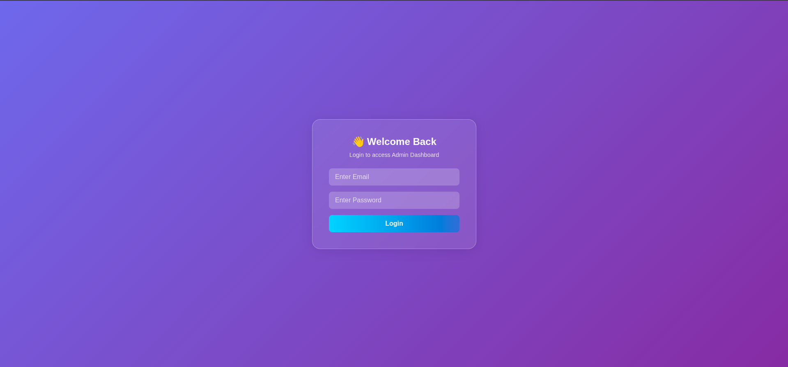
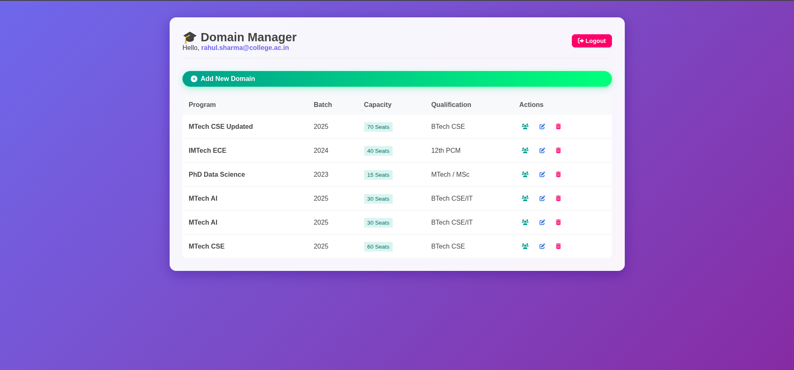

# 🎓 Student Domain Management System (CRUD)

A full-stack web application to manage academic **Domains** (Programs/Batches) and view enrolled **Students**. This project features a secure **Spring Boot Backend** with Role-Based Access Control and a modern **Glassmorphism UI** Frontend.

## ✨ Features

-   **🔐 Admin Authentication:** Secure login for Administrators (Employees with `department_id=1`).
    
-   **🏫 Domain Management:**
    
    -   **Create:** Add new academic domains (e.g., M.Tech CSE, 2025 Batch).
        
    -   **Read:** View all active domains with capacity and qualification details.
        
    -   **Update:** Edit domain details dynamically.
        
    -   **Delete:** "Safe Delete" logic that unlinks students before deleting a domain (prevents data loss).
        
-   **👥 Student View:** View a list of students enrolled in a specific domain.
    
-   **🎨 Modern UI:** Responsive Dashboard designed with Glassmorphism effects and Gradient backgrounds.
    
-   **🛡️ Security:** Spring Security integration with HTTP Basic Auth and CORS configuration.
    

## 🛠️ Tech Stack

### **Backend**

-   **Framework:** Spring Boot 3.x
    
-   **Language:** Java 17
    
-   **Database:** MySQL
    
-   **Security:** Spring Security (Stateless Basic Auth)
    
-   **ORM:** Spring Data JPA (Hibernate)
    
-   **Documentation:** Swagger / OpenAPI
    

### **Frontend**

-   **Core:** HTML5, CSS3, JavaScript (ES6+)
    
-   **Styling:** Custom CSS (Glassmorphism Design)
    
-   **Icons:** FontAwesome 6
    

* * *

## 📂 Project Structure

Plaintext

    StudentDomainCRUD/
    │
    ├── backend/               # Spring Boot Application
    │   ├── src/main/java      # Controllers, Services, Entities
    │   ├── src/main/resources # Application Properties
    │   └── pom.xml            # Maven Dependencies
    │
    └── frontend/              # User Interface
        ├── css/               # Stylesheets
        ├── js/                # Logic scripts (App & Dashboard)
        ├── index.html         # Login Page
        └── dashboard.html     # Admin Dashboard

* * *

## ⚙️ Setup & Installation

### 1\. Database Setup (MySQL)

Create a database named `springboot_project` and run the following SQL commands to set up the initial admin user and data.

SQL

    CREATE DATABASE springboot_project;
    USE springboot_project;
    
    -- Create Admin User (Password: password123)
    -- Note: {noop} is used for plain text password matching in this demo
    INSERT INTO employees (first_name, last_name, email, password, department_id, title) 
    VALUES ('Rahul', 'Sharma', 'rahul.sharma@college.ac.in', '{noop}password123', 1, 'Admin');
    
    -- (Optional) Insert Dummy Students for Testing
    INSERT INTO students (first_name, email, roll_number, domain_id) 
    VALUES ('Amit', 'amit@college.edu', 'MT2024001', 1);

### 2\. Backend Setup

1.  Navigate to the `backend` folder.
    
2.  Open `src/main/resources/application.properties` and update your MySQL credentials:
    
    Properties
    
        spring.datasource.username=YOUR_DB_USERNAME
        spring.datasource.password=YOUR_DB_PASSWORD
    
3.  Run the application:
    
    Bash
    
        ./mvnw spring-boot:run
    
    _The server will start on `http://localhost:8080`_
    

### 3\. Frontend Setup

1.  Navigate to the `frontend` folder.
    
2.  Open `index.html` using a local server (e.g., **Live Server** in VS Code).
    
    -   _Do not open the file directly by double-clicking. Use a server to avoid CORS issues._
        
3.  Login with the credentials:
    
    -   **Email:** `rahul.sharma@college.ac.in`
        
    -   **Password:** `password123`
        

* * *

## 🔌 API Endpoints

| **Method** | **Endpoint** | **Description** | **Access** |
| --- | --- | --- | --- |
| `POST` | `/api/domains` | Create a new domain | Admin |
| `GET` | `/api/domains` | Get all domains | Admin |
| `PUT` | `/api/domains/{id}` | Update domain details | Admin |
| `DELETE` | `/api/domains/{id}` | Delete a domain (Safe Delete) | Admin |
| `GET` | `/api/domains/{id}/students` | Get students of a domain | Admin |

_Full API documentation is available at: `http://localhost:8080/swagger-ui.html`_

* * *

## 📸 Screenshots

### Login Page

### Admin Dashboard (Glassmorphism UI)

* * *

## 🤝 Contributing

1.  Fork the repository.
    
2.  Create a new branch (`git checkout -b feature-branch`).
    
3.  Commit your changes (`git commit -m 'Add new feature'`).
    
4.  Push to the branch (`git push origin feature-branch`).
    
5.  Open a Pull Request.
    

* * *

**Created with ❤️ by Vivek**
